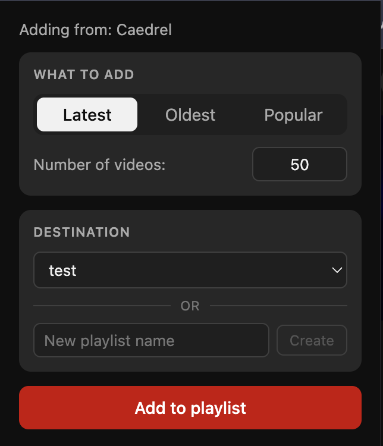

# Add Channel to Playlist

A Chrome extension that adds N latest / oldest / popular videos from a YouTube channel to one of your playlists in one click.



## Install

1. Download the latest `dist.zip` from the [Releases page](../../releases).
2. Unzip it somewhere you'll remember.
3. Open `chrome://extensions` in Chrome.
4. Toggle **Developer mode** on (top-right).
5. Click **Load unpacked** and select the unzipped folder.
6. Pin the extension from the puzzle-piece menu for easy access.

## Use

1. Navigate to a YouTube channel page (`/@handle` or `/channel/UC…`).
2. Click the extension icon.
3. Pick a sort (Latest / Oldest / Popular), a count (1–1000), and a destination playlist (or create a new one).
4. Click **Add to playlist**.

The button is disabled on non-channel pages (video, home, search, etc.) — open a channel first.

## Limitations / known issues

- **Channel pages only.** Watch pages don't expose a current channel reliably; the extension disables Add on them by design.
- **Rate limiting.** YouTube will return `429` if you add a lot in rapid succession. Wait a few minutes and try again.
- **Unofficial API.** This uses YouTube's internal Innertube endpoints rather than the public Data API. Response shapes can change without warning; if the extension stops working, the shapes likely shifted and the code needs updating.
- **Not on the Chrome Web Store.** Distributed here as an unpacked extension instead, since unofficial-API extensions can be subject to takedown.

## Build from source

Requires Node 20+.

```bash
git clone https://github.com/Blink562007/playlist_editor_extension.git
cd playlist_editor_extension
npm install
npm run build         # outputs dist/
```

Then `Load unpacked` → `dist/`.

For development:
```bash
npm test              # run unit tests
npm run typecheck     # tsc --noEmit
```

## License

MIT — do whatever you want with it.
